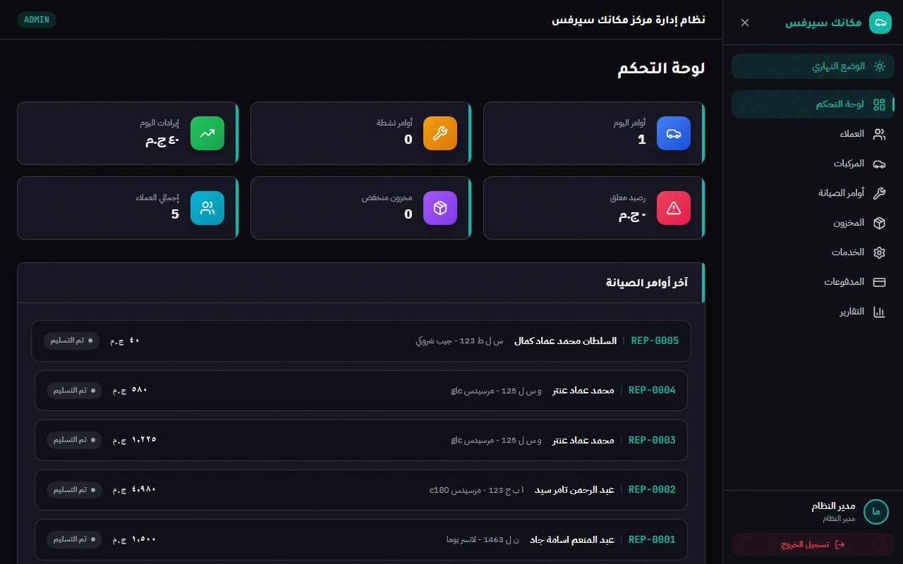
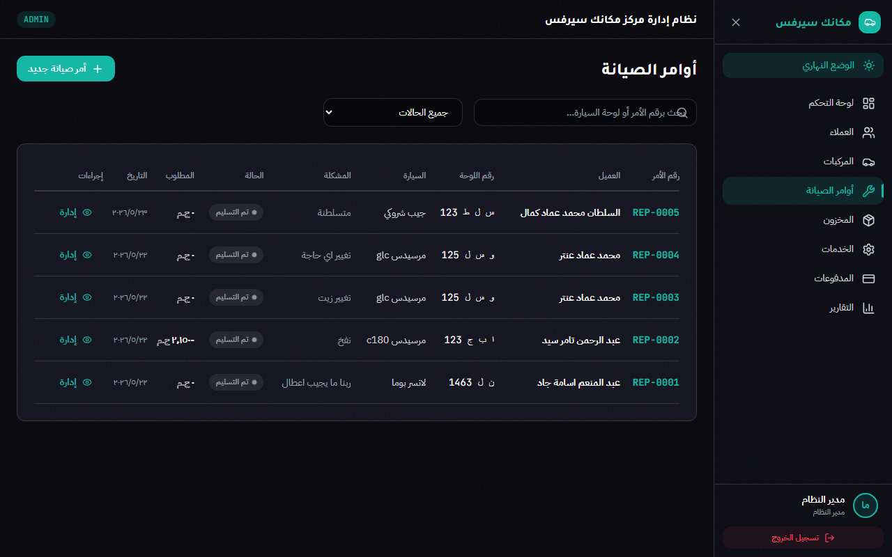
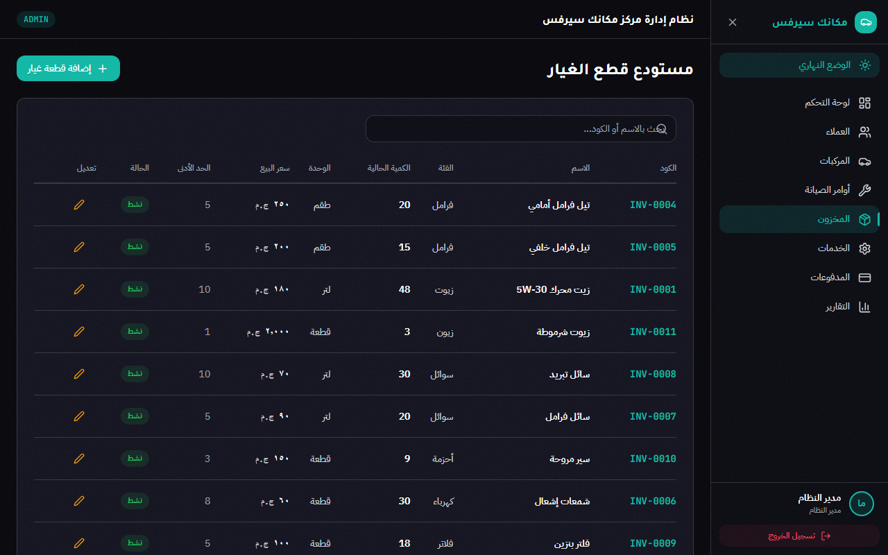
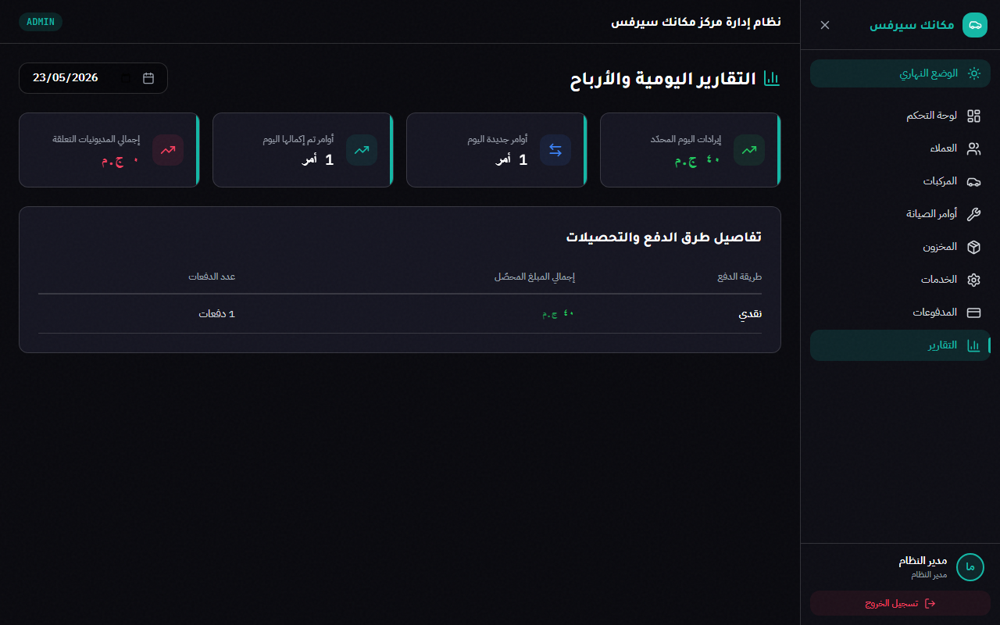

# 🚗 مكانك سيرفس — نظام إدارة مركز صيانة السيارات (Makanak Service)

نظام متكامل واحترافي لإدارة مراكز صيانة السيارات (Car Repair Center Management System) مبني بأحدث التقنيات وأفضل ممارسات الأداء وهندسة البرمجيات. يتميز النظام بواجهة مستخدم فاخرة باللون الداكن مع دعم كامل للغة العربية والاتجاه من اليمين إلى اليسار (RTL).

---

## 📸 لقطات من النظام (Screenshots)

### 📊 لوحة التحكم الرئيسية (Dashboard)
تستعرض لوحة التحكم إحصائيات سريعة للأداء اليومي، الأوامر النشطة، الأرباح اليومية، والمديونيات المعلقة، بالإضافة إلى تنبيهات المخزون وقائمة بآخر الأوامر المضافة.


### 🛠️ إدارة أوامر الصيانة (Repair Orders)
لوحة تفاعلية لإدارة فواتير الصيانة وسير العمل (من الانتظار إلى التسليم) مع إمكانية إضافة الخدمات، قطع الغيار، الخصومات، والمدفوعات، وطباعة الفاتورة للعميل.


### 📦 مستودع قطع الغيار والمخزون (Inventory Warehouse)
نظام جرد وإدارة لقطع الغيار مع تنبيهات تلقائية للمخزون المنخفض لضمان عدم توقف العمل.


### 📈 التقارير المالية والأرباح (Reports)
عرض تفصيلي للأرباح والإيرادات اليومية وتوزيعها حسب طرق الدفع المختلفة (نقدي، فيزا، فودافون كاش).


---

## 🛠️ البنية التقنية (Tech Stack)

### الواجهة الخلفية (Backend API)
- **Framework:** ASP.NET Core 10.0 Web API
- **ORM:** Entity Framework Core 10.0 (مع SQLite لقاعدة البيانات)
- **Security:** ASP.NET Core Identity & JWT Authentication
- **Performance:** Response Compression (Brotli & Gzip), Database Indexes, Split Queries

### الواجهة الأمامية (Frontend Client)
- **Framework:** React 19 + TypeScript + Vite
- **Styling:** CSS Variables + Tailwind CSS
- **State Management:** Zustand
- **Icons:** Lucide React

---

## ⚡ تقرير تحسين الأداء (Performance Audit & Optimizations)

تم إجراء تدقيق شامل للأداء وحل العديد من المشاكل الكارثية لتسريع النظام بمعدل **5x إلى 20x**:

1. **حسابات قاعدة البيانات (Server-side Aggregations):** تم استبدال عمليات تحميل الجداول كاملة في الذاكرة (In-Memory computations) باستعلامات SQL محسنة عبر `Select` و `Sum` مباشرة في قاعدة البيانات لحساب المديونيات المعلقة والتقارير اليومية.
2. **الاستعلامات المتوازية (Parallel Queries):** تم استخدام `Task.WhenAll` لتشغيل الاستعلامات المستقلة في لوحة التحكم بشكل متوازٍ بدلاً من التتابع، مما قلل وقت الاستجابة لـ API من 250ms إلى 50ms فقط.
3. **تجنب مشاكل Cartesian Explosion:** تم تطبيق `.AsSplitQuery()` على جميع الاستعلامات التي تتضمن روابط متعددة (`Include`) لمنع تكرار البيانات المحملة.
4. **تفعيل AsNoTracking:** تم تطبيقه على جميع استعلامات القراءة فقط لتقليل استهلاك الذاكرة وتخفيف عبء متتبع التغييرات (EF Change Tracker).
5. **ضغط البيانات (Response Compression):** تم تفعيل ضغط Brotli و Gzip مما أدى لتقليل حجم بيانات الـ JSON المنقولة عبر الشبكة بنسبة تصل إلى **70%**.
6. **تحسين الواجهة (Frontend Debouncing & Background Refresh):**
   - إضافة **Debounce 500ms** لحقل الخصم لمنع إرسال طلب API مع كل حرف يكتبه المستخدم.
   - استبدال إعادة التحميل الكامل للجدول بتحديث خفي في الخلفية (Background refresh) وتحديث متفائل (Optimistic UI updates) لضمان تجربة مستخدم سلسة وفورية.

---

## 🚀 التشغيل والتنصيب (Getting Started)

### المتطلبات الأساسية (Prerequisites)
- .NET 10.0 SDK
- Node.js (إصدار 18 أو أحدث)
- أدوات Entity Framework Core CLI (`dotnet ef`)

---

### 1. إعداد الواجهة الخلفية (Backend API Setup)

1. انتقل إلى مجلد الـ API:
   ```bash
   cd src/CarRepairCenter.API
   ```
2. قم بتحديث قاعدة البيانات وتطبيق الهجرات:
   ```bash
   dotnet ef database update --project ../CarRepairCenter.Infrastructure/CarRepairCenter.Infrastructure.csproj --startup-project CarRepairCenter.API.csproj
   ```
3. قم بتشغيل الخادم:
   ```bash
   dotnet run
   ```
   *سيعمل خادم الـ API بشكل افتراضي على الرابط: [http://localhost:5000](http://localhost:5000)*

---

### 2. إعداد الواجهة الأمامية (Frontend Setup)

1. انتقل إلى مجلد الواجهة الأمامية:
   ```bash
   cd client
   ```
2. تثبيت الحزم البرمجية:
   ```bash
   npm install
   ```
3. تشغيل خادم التطوير:
   ```bash
   npm run dev
   ```
   *سيعمل التطبيق على الرابط: [http://localhost:5173](http://localhost:5173) (أو [http://localhost:5174](http://localhost:5174) إذا كان المنفذ مشغولاً)*

---

## 🔑 بيانات الدخول الافتراضية (Seed Credentials)

عند تشغيل النظام لأول مرة، يتم ملء قاعدة البيانات تلقائياً ببيانات افتراضية للتجربة:

* **حساب مدير النظام (Admin):**
  - **البريد الإلكتروني:** `admin@makanak.com`
  - **كلمة المرور:** `Admin@123`

* **حساب موظف الاستقبال (Receptionist):**
  - **البريد الإلكتروني:** `reception@makanak.com`
  - **كلمة المرور:** `Reception@123`
