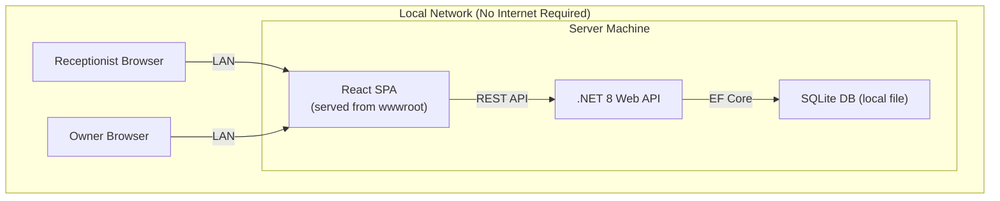
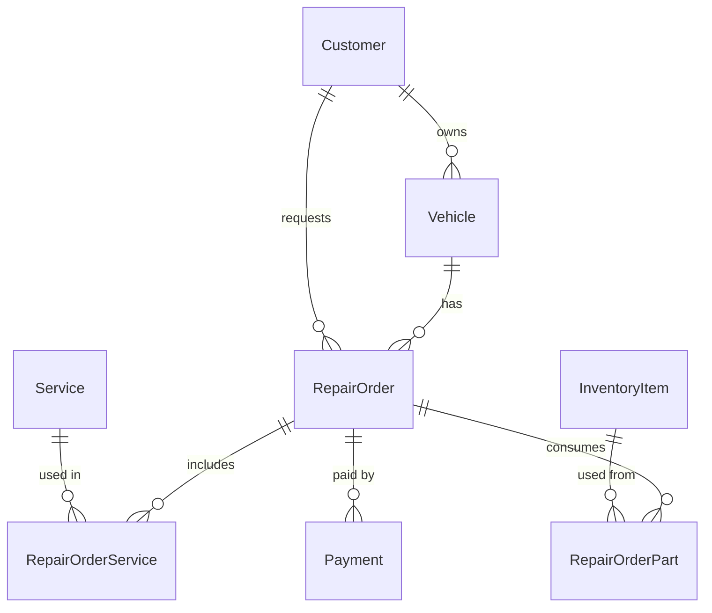

# 🚗 نظام إدارة مركز إصلاح السيارات

## Problem Statement

A car repair center runs entirely on paper — losing customer history, payment tracking, and inventory visibility. This system digitizes the full journey: registration → maintenance → billing → payment.

---

## Tech Stack

| Layer | Technology | Why |
|-------|-----------|-----|
| **Frontend** | React 18 + Vite + TypeScript | Modern SPA, fast dev, huge ecosystem |
| **UI Library** | HeroUI (formerly NextUI) | Beautiful components, dark theme, Tailwind v4, RTL support via logical properties |
| **Styling** | Tailwind CSS v4 | Utility-first, RTL with `dir="rtl"` + logical properties |
| **State** | Zustand | Lightweight global state |
| **HTTP Client** | Axios | API communication |
| **Backend** | .NET 8 Web API | User requirement |
| **ORM** | Entity Framework Core 8 | Code-first migrations |
| **Database** | SQLite | Zero-config, offline-first, file-based |
| **Auth** | ASP.NET Identity + JWT | Role-based (Admin, Receptionist) |
| **Font** | Cairo (Google Fonts) | Excellent Arabic support |

---

## Architecture



**Offline Strategy:** Self-hosted on local machine. React build output served from .NET's `wwwroot`. No internet or cloud needed.

---

## Solution Structure

```
CarRepairCenter/
├── src/
│   ├── CarRepairCenter.Core/           # Entities, Enums, Interfaces
│   ├── CarRepairCenter.Infrastructure/  # DbContext, Services, Migrations
│   └── CarRepairCenter.API/            # .NET 8 Web API (Controllers, Auth)
│       └── wwwroot/                    # React production build output
├── client/                             # React + Vite + HeroUI
│   ├── src/
│   │   ├── components/                 # Shared UI (Sidebar, StatusBadge)
│   │   ├── features/                   # Feature modules
│   │   │   ├── auth/
│   │   │   ├── dashboard/
│   │   │   ├── customers/
│   │   │   ├── vehicles/
│   │   │   ├── repair-orders/
│   │   │   ├── services-catalog/
│   │   │   ├── inventory/
│   │   │   ├── payments/
│   │   │   └── reports/
│   │   ├── hooks/
│   │   ├── layouts/                    # MainLayout, AuthLayout
│   │   ├── services/                   # API client (axios)
│   │   ├── store/                      # Zustand stores
│   │   ├── types/                      # TypeScript interfaces
│   │   └── utils/
│   └── vite.config.ts
└── CarRepairCenter.sln
```

---

## Data Model

### Entity Relationship



### Entities

**Customer** — `Id`, `CustomerCode` (auto: CUS-0001), `Name`, `Phone` (unique), `Phone2?`, `Address?`, `Notes?`, `CreatedAt`

**Vehicle** — `Id`, `CustomerId` (FK), `PlateNumber` (unique), `Make`, `Model`, `Year?`, `Color?`, `VIN?`, `Notes?`, `CreatedAt`

**Service** — `Id`, `Name`, `Description?`, `DefaultPrice`, `IsActive`, `CreatedAt`

**InventoryItem** — `Id`, `ItemCode` (auto: INV-0001), `Name`, `Category?`, `Quantity`, `UnitPrice`, `MinStockLevel`, `Unit`, `IsActive`, `CreatedAt`

**RepairOrder** — `Id`, `OrderCode` (auto: REP-0001), `CustomerId` (FK), `VehicleId` (FK), `ProblemDescription`, `Status` (enum: Waiting/InProgress/Done/Delivered), `Notes?`, `CreatedAt`, `StartedAt?`, `CompletedAt?`, `DeliveredAt?`, `CreatedByUserId`

**RepairOrderService** — `Id`, `RepairOrderId` (FK), `ServiceId` (FK), `Price` (custom per job), `Notes?`

**RepairOrderPart** — `Id`, `RepairOrderId` (FK), `InventoryItemId` (FK), `Quantity`, `UnitPrice`, `TotalPrice`

**Payment** — `Id`, `RepairOrderId` (FK), `Amount`, `PaymentMethod` (enum: Cash/Visa/InstaPay/VodafoneCash), `Notes?`, `PaidAt`, `RecordedByUserId`

> [!NOTE]
> Split payments (e.g., 500 Cash + 300 InstaPay) = two separate Payment records with same timestamp.

---

## Workflows

### Repair Journey
`Customer Arrives` → `Register/Find Customer` → `Register/Select Vehicle` → `Create Repair Order (Status: Waiting)` → `Start Work (In Progress)` → `Add Services + Parts` → `Complete (Done)` → `Print Invoice` → `Record Payment` → `Deliver Car (Delivered)`

### Status Flow
```
⏳ Waiting → 🔧 In Progress → ✅ Done → 📦 Delivered
```

### Payment Types
- **Full payment** — single payment covering total
- **Deposit** — partial payment, remainder tracked as outstanding
- **Split method** — multiple payment methods in one session
- **Installments** — multiple payments over time

---

## UI Pages (MVP)

| # | Page | Arabic | Access |
|---|------|--------|--------|
| 1 | Login | تسجيل الدخول | All |
| 2 | Dashboard | لوحة التحكم | All |
| 3 | Customers | العملاء | All |
| 4 | Vehicles | المركبات | All |
| 5 | Repair Orders | أوامر الصيانة | All |
| 6 | Services Catalog | الخدمات | Admin |
| 7 | Inventory | المخزون | Admin |
| 8 | Payments | المدفوعات | All |
| 9 | Reports | التقارير | Admin |

### Design System
- **Theme:** HeroUI dark mode (automotive aesthetic)
- **Direction:** RTL via `dir="rtl"` + Tailwind logical properties
- **Font:** Cairo (Arabic) from Google Fonts
- **Status colors:** Cyan (waiting), Amber (in progress), Green (done), Blue (delivered)

---

## Security

| Concern | Approach |
|---------|----------|
| Auth | JWT tokens (ASP.NET Identity) |
| Roles | `Admin` (full access), `Receptionist` (operations only) |
| Storage | SQLite on local machine |
| Passwords | Min 8 chars, hashed by Identity |

---

## API Endpoints (Key)

| Method | Endpoint | Description |
|--------|----------|-------------|
| POST | `/api/auth/login` | Login, returns JWT |
| GET/POST | `/api/customers` | List / Create |
| GET/POST | `/api/vehicles` | List / Create |
| GET/POST | `/api/repair-orders` | List / Create |
| PATCH | `/api/repair-orders/{id}/status` | Update status |
| POST | `/api/repair-orders/{id}/services` | Add service to order |
| POST | `/api/repair-orders/{id}/parts` | Add part to order |
| POST | `/api/payments` | Record payment |
| GET | `/api/reports/daily` | Daily financial summary |
| GET | `/api/inventory` | Stock levels |

---

## Execution Roadmap

### Phase 1: Foundation
1. Create .NET solution (Core, Infrastructure, API projects)
2. Entity models + DbContext + SQLite migrations
3. Identity setup + JWT auth + seed admin user
4. Scaffold React + Vite + HeroUI + Tailwind v4 + RTL
5. Main layout (RTL sidebar, header, dark theme)
6. API client (axios) + auth interceptor

### Phase 2: Core CRUD
7. Login page
8. Dashboard (summary cards)
9. Customer CRUD + search
10. Vehicle management (linked to customer)
11. Services catalog CRUD

### Phase 3: Repair Workflow
12. Repair order creation (select customer → vehicle → services)
13. Parts assignment (deduct from inventory)
14. Status tracking (Waiting → In Progress → Done → Delivered)
15. Invoice view + browser print

### Phase 4: Finance
16. Payment recording (all methods + split)
17. Outstanding balances tracking
18. Daily financial report

### Phase 5: Polish
19. Inventory management + low-stock alerts
20. Vehicle repair history
21. UI animations + final polish

---

## Verification Plan

- `dotnet build` — solution compiles
- `dotnet ef database update` — migrations apply
- `npm run build` — React builds without errors
- Full journey test: register customer → create order → add services/parts → pay → deliver
- Split payment + deposit scenarios
- Print invoice via browser
- Arabic RTL rendering verification
- Role-based access (admin vs receptionist)
- Offline test (disconnect internet)

---

## User Review Required

> [!IMPORTANT]
> ### Confirm These Decisions
> 1. **React + Vite + HeroUI + .NET API** — Approved?
> 2. **SQLite** for offline/zero-config — Or prefer SQL Server?
> 3. **Auto-codes** pattern (`CUS-0001`, `REP-0001`, `INV-0001`)?
> 4. **TypeScript** for React frontend?

## Open Questions

> [!WARNING]
> 1. **Center name** in Arabic — for header & invoices?
> 2. **Overall discount field** on repair order (e.g., 10% off total)?
> 3. **Zero stock** — block adding part or just warn?
> 4. **VAT/Tax** — applicable? What percentage?
> 5. **Invoice details** — center address, phone, logo?
